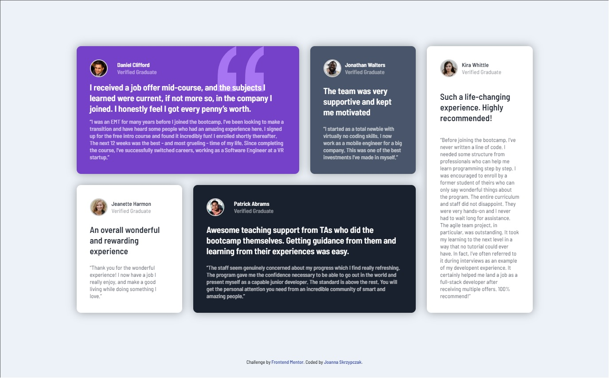
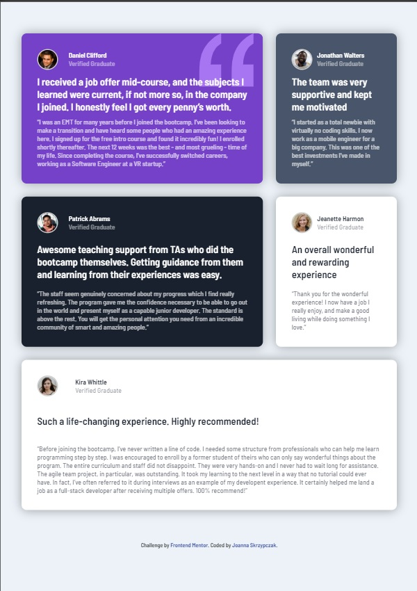

# Frontend Mentor - Testimonials grid section

## The challenge

The challenge was to build out this testimonials grid section and get it looking as close to the provided design in JPG format as possible. Moreover the users should be able to view the optimal layout for the site depending on their device's screen size.

## Results

I've created 3 layouts with mobile first approach.

### Design

### Result

#### Desktop

#### Tablet

#### Mobile

